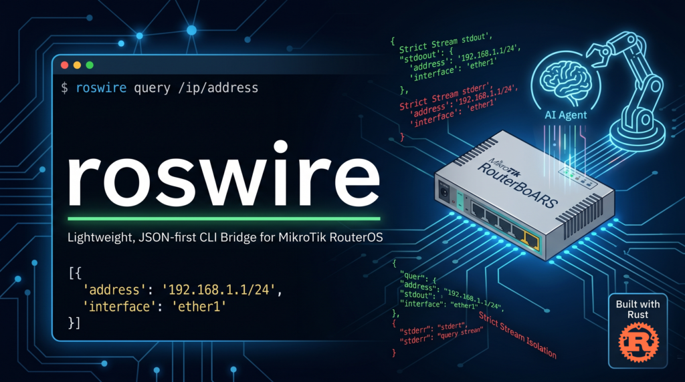
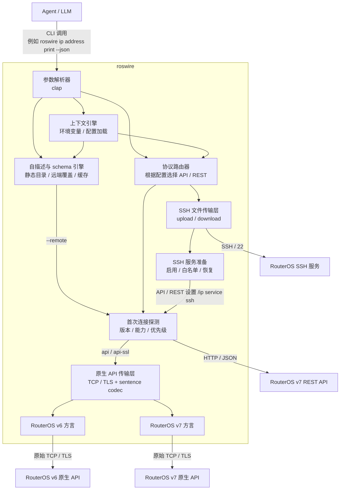

# roswire



[](https://www.rust-lang.org/)
[](LICENSE)

`roswire` 是一个轻量、JSON 优先的命令行桥接工具，面向需要操作 MikroTik RouterOS 设备的 **AI Agent** 与自动化脚本。

与面向人类交互的传统 CLI 不同，`roswire` 不输出颜色、加载动画（spinner）、分页器（pager），也不做交互式提问。它的契约很简单：成功结果写入 `stdout`，结构化错误和诊断信息写入 `stderr`。

> **项目状态：** 当前处于早期设计与实现规划阶段。下面的示例描述的是目标 CLI 契约；具体实现计划见 [`docs/develop-plan.md`](docs/develop-plan.md)。

## 核心特性

- **JSON 优先契约**：机器可读输出是 Agent 运行时和脚本集成的稳定接口。
- **严格流隔离**：`stdout` 只承载成功结果；`stderr` 承载错误、调试日志和诊断信息。
- **默认非交互**：缺少参数时直接返回结构化 JSON 错误，而不是等待用户输入。
- **协议与方言分层**：支持 RouterOS 原生 API（`8728`/`8729`）的 v6/v7 方言，以及 RouterOS v7 REST API。
- **单个原生二进制目标**：以一个 Rust 二进制文件发布，不要求 Node.js/Python/Go 等外部运行时。
- **便于 Agent 自我修正**：错误包含稳定错误码、脱敏上下文和可选修复提示。

## 安装

实现完成后，预编译二进制文件计划通过 GitHub Releases 发布。

未来版本发布的安装形式预计如下：

```bash
curl -L https://github.com/AS153929/roswire/releases/latest/download/roswire-linux-amd64.tar.gz -o /tmp/roswire-linux-amd64.tar.gz
curl -L https://github.com/AS153929/roswire/releases/latest/download/checksums.txt -o /tmp/roswire-checksums.txt
cd /tmp && sha256sum -c --ignore-missing roswire-checksums.txt
tar -xzf /tmp/roswire-linux-amd64.tar.gz -C /usr/local/bin roswire
```

在正式发布前，本仓库文档就是当前设计事实来源。

## 快速开始

1. 配置认证信息

设置环境变量，避免每条 `roswire` 命令都显式携带密码。真实部署中建议使用密钥管理器，或至少使用不会记录历史的 shell 会话。

```bash
export ROS_HOST="192.168.88.1"
export ROS_USER="admin"
export ROS_PASSWORD="your_password"
export ROS_PROTOCOL="auto"
export ROS_ROUTEROS_VERSION="auto"
export ROS_TRANSFER="ssh"
```

1. 执行命令（Agent 模式）

以结构化 JSON 获取 IP 地址列表：

```bash
roswire ip address print --json
```

输出（`stdout`）：

```json
[
  {
    ".id": "*1",
    "address": "192.168.88.1/24",
    "network": "192.168.88.0",
    "interface": "bridge",
    "actual-interface": "bridge",
    "disabled": false
  }
]
```

1. 错误处理（Agent 模式）

当命令失败时，`roswire` 以非零状态码退出，并向 `stderr` 写入结构化错误：

```bash
roswire ip address add interface=invalid_eth address=10.0.0.1/24 --json
```

输出（`stderr`，退出码：`1`）：

```json
{
  "error_code": "ROS_API_FAILURE",
  "message": "no such interface (invalid_eth)",
  "hint": "先运行 `roswire interface print --json` 查看可用接口。",
  "context": {
    "command": "ip/address/add",
    "requested_protocol": "auto",
    "selected_protocol": "rest",
    "routeros_version": "v7",
    "host": "192.168.88.1",
    "resolved_args": {
      "address": "10.0.0.1/24",
      "interface": "invalid_eth"
    }
  }
}
```

## CLI 契约

```text
roswire [global-options] <path...> <action> [key=value ...]
```

示例：

```bash
roswire interface print --json
roswire ip address add address=192.168.88.2/24 interface=bridge --json
roswire ip address remove .id=*1 --json
```

配置优先级：

1. 命令行参数
1. 环境变量
1. `~/.roswire/config.toml` 中的 profile
1. 协议默认值

本地配置目录为 `~/.roswire/`，默认配置文件为 `config.toml`，本地日志写入 `~/.roswire/logs/` 并最多保留 30 天。密码默认建议保存到本机钥匙链；配置文件只保存 secret 引用。

核心环境变量：

| 变量 | 用途 |
| --- | --- |
| `ROS_PROFILE` | 选择 `~/.roswire/config.toml` 中的 profile |
| `ROS_HOST` | RouterOS 主机名或 IP 地址；不支持 MAC 地址直连 |
| `ROS_USER` | RouterOS 用户名 |
| `ROS_PASSWORD` | RouterOS 密码 |
| `ROSWIRE_HOME` | 覆盖默认 `~/.roswire` 目录，主要用于测试或便携环境 |
| `ROS_PROTOCOL` | `auto`、`api`、`api-ssl` 或 `rest` |
| `ROS_ROUTEROS_VERSION` | `auto`、`v6` 或 `v7`，用于选择原生 API 方言 |
| `ROS_TRANSFER` | 文件传输后端；当前唯一支持值为 `ssh` |
| `ROS_SSH_PORT` | RouterOS SSH 服务端口，默认 `22` |
| `ROS_SSH_USER` | SSH 文件传输用户名；默认复用 `ROS_USER` |
| `ROS_SSH_PASSWORD` | SSH 文件传输密码；默认复用 `ROS_PASSWORD` |
| `ROS_SSH_KEY` | SSH 私钥路径；设置后优先使用 key auth |
| `ROS_SSH_HOST_KEY` | RouterOS SSH host key 指纹，用于非交互校验服务器身份 |
| `ROS_SSH_ALLOW_FROM` | 需要写入 `/ip service ssh address` 的客户端来源白名单 CIDR |
| `ROS_PORT` | 显式协议的可选端口覆盖；`auto` 模式不接受单一端口覆盖 |

## Agent 自描述接口

`roswire` 面向 Agent 使用，因此所有关键帮助和配置检查都必须提供稳定 JSON 输出。Agent 不需要解析人类帮助文本。

常用自描述命令：

```bash
roswire help --json
roswire help ip address add --json
roswire commands --json
roswire schema command ip address add --json
roswire schema command ip address add --remote --json
roswire schema discover --remote --json
roswire config inspect --json
roswire config profiles --json
roswire doctor --json
roswire explain-error ROS_API_FAILURE --json
```

约定：

- `help --json` 是机器可读帮助，输出完整命令目录、参数结构、示例、输出 schema、错误码和自愈提示；`--help` 保留给人类阅读。
- `config inspect --json` 输出解析后的 profile、字段来源和 secret 状态，但永远脱敏密码、token 和私钥。
- `doctor --json` 默认只做本地检查；只有显式传入 `--include-remote` 才访问 RouterOS。
- 默认帮助和 schema 来自 `roswire` 内置静态目录；传入 `--remote` 才连接 RouterOS，叠加设备实际版本、协议能力、可观测字段和运行时枚举值。
- 远端 schema 发现结果可以缓存到 `~/.roswire/cache/`，但必须按 RouterOS 版本、build time、packages 和协议能力失效；缓存不能包含 secret 或完整本地路径。
- 自描述输出包含 `schema_version`，便于 Agent 做兼容判断。

## 调用优先级

当 `ROS_PROTOCOL=auto` 时，`roswire` 会在首次连接阶段执行只读探测，判断 RouterOS 版本与可用协议，然后把实际命令路由到合适后端。

固定优先级如下：

1. 显式指定非 `auto` 的 `--protocol` 或 `ROS_PROTOCOL` 时，严格按指定协议调用，不自动改道。
1. 自动模式下优先探测 `rest`，再探测 `api-ssl`，最后探测 `api`。
1. 如果确认是 RouterOS v7，且 REST 可用、当前动作有 REST 映射，则优先走 REST。
1. 如果 REST 不可用，或者当前动作没有 REST 映射，则回落到 RouterOS v7 原生 API 方言。
1. 如果确认是 RouterOS v6，则只走原生 API v6 方言；REST 不参与路由。

探测失败时的处理也要稳定：网络不可达或服务未开启时继续尝试下一个候选协议；认证失败属于终止错误，不用另一个协议静默重试，以免掩盖凭据问题。

## 原生 API 方言

RouterOS v6 与 v7 都支持原生 API，但它们在登录流程、菜单字段、错误返回和命令可用性上存在差异。`roswire` 的实现策略是：

- 共享 TCP/TLS 连接、RouterOS sentence 编解码和 `!re`/`!done`/`!trap` 解析。
- 分开实现 v6 与 v7 的登录兼容、字段归一化、动作映射和测试 fixture。
- 默认使用 `ROS_ROUTEROS_VERSION=auto` 自动探测；必要时可以显式设置为 `v6` 或 `v7`，避免 Agent 在不确定环境里误判。
- 允许方言层保留适度重复代码，优先换取行为清晰和测试稳定；但不复制底层传输与编码逻辑。

## 协议映射

| CLI 命令 | 原生 API（v6/v7 方言） | REST API |
| --- | --- | --- |
| `roswire ip address print` | `/ip/address/print` | `GET /rest/ip/address` |
| `roswire ip address add address=1.1.1.1 interface=ether1` | `/ip/address/add` | `PUT /rest/ip/address` |
| `roswire ip address set .id=*1 disabled=true` | `/ip/address/set` | `PATCH /rest/ip/address/*1` |
| `roswire ip address remove .id=*1` | `/ip/address/remove` | `DELETE /rest/ip/address/*1` |

## 客户端文件上传下载

`roswire` 应该支持“本机客户端 ↔ RouterOS 设备”的文件工作流，例如上传 `.rsc` 脚本、导入配置、生成并下载备份。这里要分清两层：

- **控制面**：用 API/REST 执行 RouterOS 命令，例如 `/import`、`/export file=...`、`/system/backup/save`、`/file print`。
- **数据面**：真正传输文件字节，不能依赖 API sentence 或 REST JSON 直接承载大文件。

目标命令形态示例：

```bash
roswire file upload ./setup.rsc flash/setup.rsc --transfer ssh --json
roswire import ./setup.rsc --remote-path flash/setup.rsc --ensure-ssh --allow-from 203.0.113.10/32 --cleanup --json
roswire backup download ./backup.backup --name pre-change --ensure-ssh --allow-from 203.0.113.10/32 --cleanup --json
roswire export download ./config.rsc --compact --ensure-ssh --allow-from 203.0.113.10/32 --cleanup --json
```

推荐策略：

- 上传普通文件：走 SSH transfer 后端，把本机文件放到 RouterOS 文件系统，再按需执行后续命令。
- 上传并执行 `.rsc`：先上传到临时路径，再通过 API/REST 执行 `/import file-name=...`，成功后可删除临时文件。
- 创建并下载备份：先通过 API/REST 执行 `/system/backup/save name=...`，再通过 SSH transfer 后端下载生成的 `.backup` 文件。
- 创建并下载导出配置：先执行 `/export file=...`，再下载生成的 `.rsc` 文件。
- 写入 `/system/script`：如果只是把本地文本作为脚本 source，可以直接通过 API/REST 设置 `source=@local-file` 的内容，不必先上传成文件；需要限制大小并禁止二进制。

文件传输只支持 SSH 通道。`roswire` 可以通过 API/REST 检查并配置 `/ip service ssh`：启用 SSH 服务、设置端口、把 `--allow-from` / `ROS_SSH_ALLOW_FROM` 写入服务的 `address` 白名单。默认不擅自打开 SSH；只有显式传入 `--ensure-ssh` 时才允许修改设备服务配置。传输结束后可以按策略恢复原始 SSH 服务状态。

注意：`host` / `ROS_HOST` / `--host` 必须是可路由的 IP 地址或 DNS 名。RouterOS 的 MAC 地址只适用于二层发现/邻居发现场景，当前 CLI 的 API、REST 与 SSH 连接不支持 MAC 地址直连。

实现阶段必须验证目标 RouterOS 版本实际支持的 SSH 文件传输子协议，并统一封装在 `ssh` transfer 后端下。不要默认假设 REST API 支持 multipart 上传，也不要保留 FTP、`/tool fetch` 等其它文件传输后端。

## 架构



## 开发路线

实现计划记录在 [`docs/develop-plan.md`](docs/develop-plan.md)。当前优先级如下：

1. Rust 项目脚手架与 CLI 解析。
1. 稳定 JSON 错误模型与输出流隔离。
1. 首次连接探测、协议优先级与自动路由。
1. RouterOS 原生 API 共享传输层与 v6/v7 方言实现。
1. RouterOS v7 REST 协议实现。
1. 基于 RouterOS CHR 或专用测试设备的集成测试。
