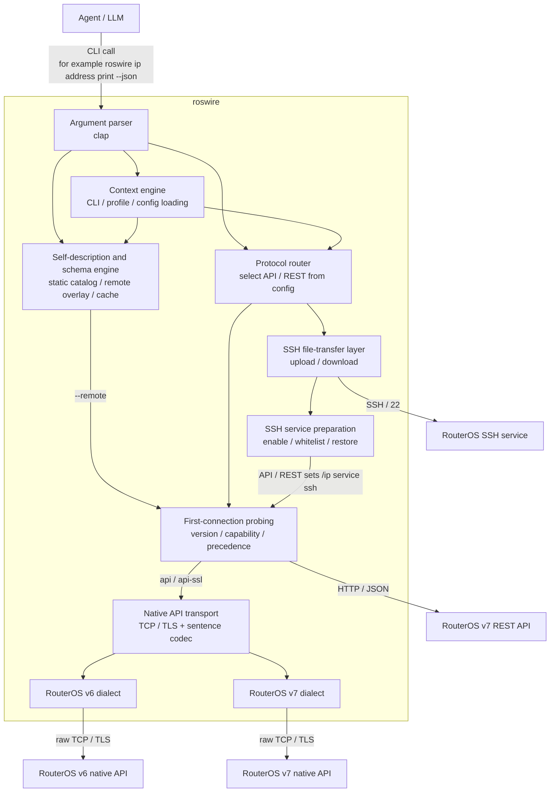

# roswire


[](https://www.rust-lang.org/)
[](LICENSE)

**Language / 语言:** English | [简体中文](README.zh-CN.md)

`roswire` is a lightweight, JSON-first command-line bridge for **AI agents** and automation scripts that need to operate MikroTik RouterOS devices.

Unlike traditional CLIs designed for human interaction, `roswire` does not emit colors, spinners, pagers, or interactive prompts. Its contract is simple: successful results go to `stdout`; structured errors and diagnostics go to `stderr`.

> **Project status:** MVP / beta candidate. The core JSON-first CLI, configuration, protocol routing, self-description APIs, SSH file transfer, file workflows, and release engineering are in place. Production-stable status is still gated by the real RouterOS / CHR acceptance matrix. See [`docs/production-readiness.md`](docs/production-readiness.md) for production gates and [`docs/develop-plan.md`](docs/develop-plan.md) for the development plan.

## Key features

- **JSON-first contract:** machine-readable output is the stable interface for agents and scripts.
- **Strict stream separation:** `stdout` contains successful results only; `stderr` contains errors, debug logs, and diagnostics.
- **Non-interactive by default:** missing inputs fail with structured JSON errors instead of waiting for user input.
- **Protocol and dialect layering:** supports RouterOS native API (`8728` / `8729`) with v6/v7 dialects plus RouterOS v7 REST API.
- **Single native binary:** distributed as one Rust binary; no Node.js, Python, Go, or other runtime required.
- **Agent-friendly self-correction:** errors include stable error codes, redacted context, and optional repair hints.

## Installation

Prebuilt binaries are published through GitHub Releases, with a `checksums.txt` file attached to each release.

Linux quick install:

```bash
curl -fsSL https://raw.githubusercontent.com/AS153929/roswire/main/scripts/install.sh | sh
```

The installer detects Linux x86_64 / arm64, downloads the matching latest release artifact, verifies `checksums.txt`, and installs `roswire` to `/usr/local/bin`. To install a pinned version or a user-local path:

```bash
curl -fsSL https://raw.githubusercontent.com/AS153929/roswire/main/scripts/install.sh | ROSWIRE_VERSION=v0.0.3 ROSWIRE_INSTALL_DIR="$HOME/.local/bin" sh
roswire doctor --json
```

If Rust is already installed, crates.io installation is also supported after the crate is published:

```bash
cargo install roswire --locked
```

### Agent skill

The repository also ships an optional `roswire` agent skill under [`skills/roswire`](skills/roswire). It demonstrates how an AI agent can discover `roswire` command schemas, run read-only RouterOS evidence collection, and summarize JSON results safely. This installs the skill only; install the `roswire` binary separately using one of the methods above.

Inspect the skills available in this repository:

```bash
npx skills add https://github.com/AS153929/roswire --list --full-depth
```

If the list shows `roswire`, install that specific skill:

```bash
npx skills add https://github.com/AS153929/roswire --skill roswire --full-depth
```

Install the `roswire` skill globally for all supported agents:

```bash
npx skills add https://github.com/AS153929/roswire --skill roswire --agent '*' --global --full-depth --yes
```

Install it for the current project instead:

```bash
npx skills add https://github.com/AS153929/roswire --skill roswire --agent '*' --full-depth --yes
```

When developing from a local checkout, run this from the repository root:

```bash
npx skills add . --skill roswire --agent '*' --global --full-depth --copy --yes
```

`--full-depth` is needed because the skill lives below `skills/roswire/` rather than at the repository root.

For manual installation steps, Cargo installation notes, Windows PowerShell checksum verification, source builds, and uninstall instructions, see [`docs/installation.md`](docs/installation.md). Maintainer release procedures are documented in [`docs/release.md`](docs/release.md).

## Quick start

This path starts with a fresh install, checks the local environment, creates one profile, stores the password outside shell history, and runs the first read-only RouterOS command.

1. Install and run local diagnostics

```bash
curl -fsSL https://raw.githubusercontent.com/AS153929/roswire/main/scripts/install.sh | sh
roswire doctor --json
```

`doctor` only checks the local machine by default. It does not contact RouterOS unless `--include-remote` is passed.

1. Initialize local configuration

```bash
roswire config init --json
```

1. Create and inspect a RouterOS profile

```bash
roswire config device add studio \
  host=192.168.88.1 \
  user=admin \
  protocol=auto \
  routeros_version=auto \
  transfer=ssh \
  ssh_host_key=SHA256:replace-with-routeros-host-key \
  allow_from=203.0.113.10/32 \
  --json
roswire config profiles --json
roswire --profile studio config inspect --json
```

1. Store the password without putting it in shell history

The `env` secret backend stores only the environment variable name in `config.toml`; the secret value stays in the current process environment.

```bash
read -rsp 'RouterOS password: ' ROSWIRE_STUDIO_PASSWORD; echo
export ROSWIRE_STUDIO_PASSWORD
roswire config secret set studio password type=env env=ROSWIRE_STUDIO_PASSWORD --json
```

For production hosts, prefer an OS keychain or encrypted secret backend when available. Store the secret with your platform keychain tool first, then save only the reference in `roswire`:

```bash
roswire config secret set studio password type=keychain service=roswire account=profiles/studio/password --json
```

1. Run the first read-only RouterOS command

```bash
roswire --profile studio interface print --json
```

Output (`stdout`) is structured JSON; errors go to `stderr` as one structured JSON object.

## Common tasks

| Intent | Command |
| --- | --- |
| Check local setup | `roswire doctor --json` |
| Create or inspect profiles | `roswire config init --json`, `roswire config profiles --json`, `roswire --profile studio config inspect --json` |
| Store credentials safely | `roswire config secret set studio password type=env env=ROSWIRE_STUDIO_PASSWORD --json` or `type=keychain` |
| Inventory interfaces, addresses, routes, and resources | `roswire --profile studio interface print --json`, `roswire --profile studio ip address print --json`, `roswire --profile studio ip route print --json`, `roswire --profile studio system resource print --json` |
| Run unsupported read-only RouterOS print commands | `roswire --profile studio raw /system/resource/print --json` |
| Preview file transfers safely | `roswire --profile studio file upload ./setup.rsc flash/setup.rsc --dry-run --ssh-host-key SHA256:replace-with-routeros-host-key --allow-from 203.0.113.10/32 --json` |

## Command usage examples

Local diagnostics:

```bash
roswire doctor --json
```

Profile creation and inspection:

```bash
roswire config init --json
roswire config device add studio host=192.168.88.1 user=admin protocol=auto routeros_version=auto transfer=ssh --json
roswire config profiles --json
roswire --profile studio config inspect --json
```

Secret setup without command-line password values:

```bash
read -rsp 'RouterOS password: ' ROSWIRE_STUDIO_PASSWORD; echo
export ROSWIRE_STUDIO_PASSWORD
roswire config secret set studio password type=env env=ROSWIRE_STUDIO_PASSWORD --json

read -rsp 'SSH key passphrase: ' ROSWIRE_STUDIO_SSH_KEY_PASSPHRASE; echo
export ROSWIRE_STUDIO_SSH_KEY_PASSPHRASE
roswire config secret set studio ssh_key_passphrase type=env env=ROSWIRE_STUDIO_SSH_KEY_PASSPHRASE --json

roswire config secret set studio password type=keychain service=roswire account=profiles/studio/password --json
```

Common read-only RouterOS commands:

```bash
roswire --profile studio interface print --json
roswire --profile studio ip address print --json
roswire --profile studio ip route print --json
roswire --profile studio ip firewall filter print stats --json
roswire --profile studio ip firewall connection print count-only --json
roswire --profile studio system resource print --json
```

Raw read-only print commands for advanced RouterOS paths:

```bash
roswire --profile studio raw /system/resource/print --json
roswire --profile studio raw /interface/print detail --json
roswire --profile studio raw /ip/dhcp-client/print detail --json
```

Transfer dry runs with explicit SSH safety inputs:

```bash
roswire --profile studio file upload ./setup.rsc flash/setup.rsc \
  --dry-run \
  --ssh-host-key SHA256:replace-with-routeros-host-key \
  --allow-from 203.0.113.10/32 \
  --json
roswire --profile studio file download flash/config.rsc ./config.rsc \
  --dry-run \
  --ssh-host-key SHA256:replace-with-routeros-host-key \
  --allow-from 203.0.113.10/32 \
  --json
```

## CLI contract

```text
roswire [global-options] <path...> <action> [key=value ...]
```

Configuration precedence is intentionally simple:

1. Command-line options, including global options such as `--profile`, `--host`, `--user`, `--protocol`, and `--routeros-version`
1. Profile values in `~/.roswire/config.toml`
1. Protocol defaults

The local configuration directory is `~/.roswire/` by default. It contains `config.toml`, local logs under `~/.roswire/logs/`, and keeps logs for up to 30 days. Passwords should preferably be stored in the local keychain or referenced through a secret backend; config files should store secret references only.

Device fields map to these profile keys: `host`, `user`, `protocol`, `routeros_version`, `transfer`, `port`, `ssh_port`, `ssh_user`, `ssh_key`, `ssh_host_key`, and `allow_from`. These device fields do **not** come from single-device `ROS_*` environment variables. Environment variables are process-level settings or secret-backend inputs only.

Process-level environment variables and secret-backend variables:

| Variable | Purpose |
| --- | --- |
| `ROSWIRE_HOME` | Override the default `~/.roswire` directory, mainly for tests or portable environments. |
| `ROSWIRE_DEBUG` | Enable redacted debug diagnostics. |
| `ROSWIRE_MASTER_KEY` | Default master key for encrypted secrets; a secret `key_id` can point to another variable. |
| Custom variables referenced by profile secrets with `type=env` | For example `ROSWIRE_STUDIO_PASSWORD`; read only through the secret backend and never used for device field precedence. |

Passwords and SSH key passphrases use profile secrets: `password`, `ssh_password`, and `ssh_key_passphrase`.

Detailed docs: [`docs/installation.md`](docs/installation.md), [`docs/release.md`](docs/release.md), [`docs/routeros-acceptance-matrix.md`](docs/routeros-acceptance-matrix.md), and [`docs/production-readiness.md`](docs/production-readiness.md).

## Agent self-description APIs

`roswire` is intended for agent use, so all important help and configuration inspection surfaces provide stable JSON. Agents do not need to parse human help text.

Common self-description commands:

```bash
roswire help --json
roswire help ip address add --json
roswire commands --json
roswire schema command ip address add --json
roswire schema command ip address add --remote --json
roswire schema discover --remote --json
roswire config inspect --json
roswire config profiles --json
roswire doctor --json
roswire explain-error ROS_API_FAILURE --json
```

Conventions:

- `help --json` is machine-readable help with the command catalog, argument shape, examples, output schemas, error codes, and repair hints; `--help` remains for humans.
- `config inspect --json` reports the active profile, resolved field sources, and secret status, but always redacts passwords, tokens, and private key paths.
- `doctor --json` runs local checks by default; it reaches RouterOS only when `--include-remote` is passed.
- Static help and schemas come from `roswire`'s built-in catalog by default. `--remote` connects to RouterOS and overlays real device version, protocol capabilities, observable fields, and runtime enum values.
- Remote schema discovery can cache results under `~/.roswire/cache/`, but cache invalidation must include RouterOS version, build time, packages, and protocol capability; caches must never contain secrets or full local paths.
- Self-description outputs include `schema_version` so agents can make compatibility decisions.

## Protocol selection

When `protocol=auto` (the default), `roswire` performs read-only probing on first connection to determine the RouterOS version and available protocols, then routes the actual command to the best backend.

Fixed precedence:

1. If `--protocol` or profile `protocol` explicitly sets a non-`auto` protocol, use it strictly and do not auto-reroute.
1. In automatic mode, probe `rest` first, then `api-ssl`, then `api`.
1. If the device is RouterOS v7, REST is available, and the current action has a REST mapping, prefer REST.
1. If REST is unavailable or the action has no REST mapping, fall back to the RouterOS v7 native API dialect.
1. If the device is RouterOS v6, use only the native API v6 dialect; REST is not part of v6 routing.

Probe failure handling is stable: network unreachable or disabled service errors continue to the next candidate; authentication failure is terminal and does not silently retry another protocol, because doing so could hide credential problems.

## Native API dialects

RouterOS v6 and v7 both support the native API, but they differ in login flows, menu fields, error returns, and available commands. `roswire` uses this implementation strategy:

- Share TCP/TLS connections, RouterOS sentence encoding/decoding, and `!re` / `!done` / `!trap` parsing.
- Keep v6 and v7 login compatibility, field normalization, action mappings, and test fixtures separate.
- Default to `routeros_version=auto` probing; use `--routeros-version` or a profile value to force `v6` / `v7` in controlled environments.
- Allow some deliberate duplication in dialect code to keep behavior clear and tests stable, but do not duplicate the low-level transport and encoding logic.

## Protocol mappings

| CLI command | Native API (v6/v7 dialects) | REST API |
| --- | --- | --- |
| `roswire ip address print` | `/ip/address/print` | `GET /rest/ip/address` |
| `roswire ip address add address=1.1.1.1 interface=ether1` | `/ip/address/add` | `PUT /rest/ip/address` |
| `roswire ip address set .id=*1 disabled=true` | `/ip/address/set` | `PATCH /rest/ip/address/*1` |
| `roswire ip address remove .id=*1` | `/ip/address/remove` | `DELETE /rest/ip/address/*1` |

## Client-side file upload and download

`roswire` supports local-client-to-RouterOS file workflows such as uploading `.rsc` scripts, importing configuration, generating backups, and downloading artifacts. These workflows have two layers:

- **Control plane:** API/REST commands such as `/import`, `/export file=...`, `/system/backup/save`, and `/file print`.
- **Data plane:** actual file-byte transfer; API sentences and REST JSON must not be treated as a general large-file transport.

Target command shapes:

```bash
roswire file upload ./setup.rsc flash/setup.rsc --transfer ssh --json
roswire import ./setup.rsc --remote-path flash/setup.rsc --ensure-ssh --allow-from 203.0.113.10/32 --cleanup --json
roswire backup download ./backup.backup --name pre-change --ensure-ssh --allow-from 203.0.113.10/32 --cleanup --json
roswire export download ./config.rsc --compact --ensure-ssh --allow-from 203.0.113.10/32 --cleanup --json
```

Recommended strategy:

- Plain file upload: use the SSH transfer backend to place a local file on the RouterOS filesystem, then run follow-up commands if needed.
- Upload and execute `.rsc`: upload to a temporary path, execute `/import file-name=...` through API/REST, and optionally delete the temporary file after success.
- Create and download backups: run `/system/backup/save name=...`, then download the resulting `.backup` file through SSH transfer.
- Create and download exports: run `/export file=...`, then download the generated `.rsc` file.
- Write `/system/script`: when the source is local text, API/REST can write `source=@local-file` contents directly without creating a RouterOS file; size limits and binary rejection still apply.

File transfer uses SSH only. `roswire` can inspect and configure `/ip service ssh` through API/REST: enable SSH, set the port, and merge `--allow-from` or profile `allow_from` into the service `address` whitelist. It never opens SSH implicitly; it may modify the device service only when `--ensure-ssh` is explicitly provided. Transfer cleanup can restore the original SSH service state according to policy.

Note: profile `host` or `--host` must be a routable IP address or DNS name. RouterOS MAC addresses are for Layer 2 neighbor discovery and are not supported by the current API, REST, or SSH connection paths.

The SSH transfer backend must validate the actual SSH file-transfer subprotocols supported by the target RouterOS version. Do not assume REST multipart upload support, and do not keep FTP, `/tool fetch`, or other transfer backends.

## Architecture



## Development roadmap

The implementation plan lives in [`docs/develop-plan.md`](docs/develop-plan.md). Current priorities:

1. Rust project scaffolding and CLI parsing.
1. Stable JSON error model and output stream separation.
1. First-connection probing, protocol precedence, and automatic routing.
1. RouterOS native API shared transport plus v6/v7 dialects.
1. RouterOS v7 REST protocol implementation.
1. Integration tests using RouterOS CHR or dedicated test devices.
